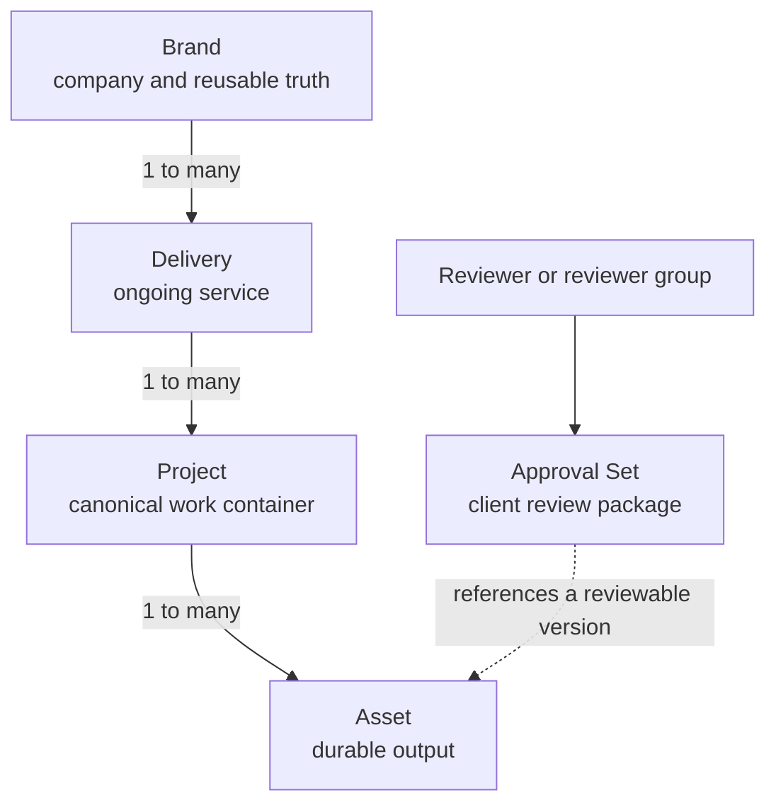

# Power Creatives — Architecture Philosophy

> **Status:** Owner-directed working model, recorded 2026-08-06.  
> **Scope:** Domain language, ownership, hierarchy, and architectural invariants.  
> **Not yet:** A database migration, API contract, UI specification, or claim that the current implementation already complies.

## 1. Why this document exists

Power Creatives needs one shared mental model that product, design, and engineering can use when adding or changing features. Without it, modules can invent competing meanings for Brand, Delivery, Project, Asset, and Approval Set, producing duplicated links, orphaned data, hard-coded asset types, and fragile approval behavior.

This document defines the intended business model. It complements:

- `ARCHITECTURE.md`, which describes the technical structure of the plugin.
- `architecture-vision.md`, which describes the modular-monolith and vertical-slice direction.
- `ARCHITECTURE-BUSINESS-SPINE-20260717.md`, which defines how brand facts and business units are resolved for SEO and site operations.

If a code comment or older document conflicts with the domain model here, the conflict must be surfaced and resolved. It must not be silently copied into new code.

## 2. Ubiquitous language

These names must mean the same thing in the UI, API, database, documentation, and conversations.

### Brand

A **Brand** represents the company or client identity that owns the work.

It is the root of the business context and holds reusable brand truth, including names, colors, fonts, logos, tone of voice, business details, and other brand-wide facts. Work below the Brand consumes this context; it does not create competing copies of it as independent truth.

One Brand can have many Deliveries.

### Delivery

A **Delivery** represents an ongoing service or fulfilment responsibility for a Brand.

Examples include SEO, Google Ads, Meta Ads, content production, and website management. A Delivery may have a start date, but it does not require an end date. It may continue indefinitely while the client relationship or service remains active.

A Delivery belongs to one Brand and can have many Projects.

### Project

A **Project** is the lowest canonical organizational container for produced work.

It groups the assets for a coherent initiative such as a campaign, a website, a launch, or another body of work that should be managed together. A Project belongs to one Delivery and therefore derives its Brand through that Delivery.

A Project can move through an internal production workflow, visually similar to the existing Approval Set board. Project status and Approval Set status are separate state machines: Project status describes internal production; Approval Set status describes external review.

A Project may have dates, but its identity is defined by its scope and work—not by requiring an end date. A long-lived Project is therefore valid when the product needs one.

### Asset

An **Asset** is a durable output created, imported, edited, or managed by Power Creatives.

Asset types can include:

- image;
- video;
- audio;
- document;
- copy, including ad copy;
- article or other structured text;
- site or website deliverable;
- future output types introduced by modules.

Generation and editing modules produce Assets; they do not own permanent, module-specific silos of business output. Every Asset has one canonical Project home in the target model. Its Delivery and Brand are derived live through that Project.

A connected WordPress **Site record** is currently an operational target holding connection details. A future **site Asset** is a produced deliverable. Those concepts may reference each other, but they are not automatically the same entity.

### Approval Set

An **Approval Set** is a client-facing review package containing selected, reviewable versions of Assets.

It exists so a team can send the correct subset of work to one or more reviewers without exposing an entire Project. It owns the review context: recipients, share access, review status, comments, decisions, and the exact versions presented.

An Approval Set is not the canonical owner of an Asset. Adding an Asset to an Approval Set does not move it out of its Project. The set references or snapshots a reviewable version of the Asset.

Approval Sets must be asset-type-extensible. Approval behavior should be driven by a generic asset contract or adapter registry, not by permanent hard-coded buckets for image, copy, article, and every future type.

## 3. Canonical hierarchy and review projection



The solid path is the ownership and organizational hierarchy:

```text
Brand → Delivery → Project → Asset
```

The dotted path is an orthogonal review relationship:

```text
Approval Set → selected Asset versions
```

This distinction is the central architectural rule. A Project answers **where the work belongs**. An Approval Set answers **what a reviewer is being asked to review now**.

## 4. Binding architectural principles

### 4.1 One canonical parent path

Brand and Delivery context is resolved through the hierarchy rather than independently authored on every child record:

```text
asset.projectId → project.deliveryId → delivery.brandId
```

Duplicated hierarchy IDs may only exist as deliberate, documented denormalization or immutable audit data. They must never become a second mutable source of truth.

### 4.2 Context follows reassignment

If a Project moves to another Delivery, all of its Assets inherit the new Delivery and Brand context automatically. Modules must resolve that context through the shared hierarchy contract rather than cache their own interpretation.

Historical approval records are different: a review must retain the context and Asset version that the reviewer actually saw, even if the live Project later moves or the Asset changes.

### 4.3 Projects organize; Approval Sets review

Projects and Approval Sets may look similar as boards or status-driven entities, but they have different responsibilities. They must not be collapsed into one entity merely because their interfaces are similar.

### 4.4 Assets are polymorphic, not bucket-driven

The core Asset contract holds stable identity and shared metadata. Type-specific modules own type-specific behavior and representation behind contracts. Adding audio, a new document type, or a new generated surface should not require rewriting the Approval Set schema and every review screen.

### 4.5 Approval is version-specific

A reviewer approves the exact version presented, not an unspecified live object that can mutate during review. A new material revision creates a new reviewable version or review round while preserving the previous comments and decisions as audit history.

### 4.6 Lifecycle state belongs to its entity

- Delivery status describes an ongoing service relationship.
- Project status describes internal work progress.
- Asset status, if needed, describes the Asset lifecycle.
- Approval Set status describes client review progress.
- Per-Asset review decisions belong to the Approval Set membership or reviewed version, not to the Project status.

Sharing labels or visual components is encouraged; sharing semantics accidentally is not.

### 4.7 No invisible orphans

The target model should not rely on null hierarchy values as the normal operating mode. Demo, system, imported, or experimental work should be placed in an explicit system/demo Brand, Delivery, and Project if those contexts are required. Orphan handling is a migration concern, not a permanent domain concept.

## 5. Three models considered

| Model | Description | Scalability | Integrity | Migration risk | Decision |
|---|---|---:|---:|---:|---|
| **A. Canonical hierarchy + review projection** | Assets belong to Projects; Approval Sets reference versioned Assets. | High | High | Medium | **Recommended** |
| **B. Dual-parent Assets** | An Asset belongs to either a Project or an Approval Set and may move between them. | Low | Low | Medium | Rejected |
| **C. Universal collection graph** | Projects and Approval Sets are generic nested collections containing Assets or other collections. | High in theory | Medium | High | Defer |

### Why Model A is recommended

It matches the owner-described hierarchy, preserves one clear home for every output, allows the same Asset to participate in review without being moved, and lets approval history be version-specific. It also aligns with the hierarchy resolver already present in the codebase, reducing conceptual migration risk.

### Why Model B is rejected

Dual ownership makes Project context disappear or change when work is sent for approval. It creates ambiguous permissions, inheritance, filtering, deletion behavior, and return-from-review behavior.

### Why Model C is deferred

A universal collection graph can support arbitrary nesting, but it introduces cycle prevention, inherited permissions, mixed lifecycle semantics, recursive queries, and unclear UX. The current product need does not justify that complexity. It can be reconsidered only when a concrete use case cannot be represented by Model A.

## 6. Current implementation versus target model

The repository already contains part of the intended spine, but it does not yet enforce the full model:

- `PCM_Hierarchy` resolves Brand → Delivery → Project live.
- `projects.deliveryId` is nullable today.
- `deliveries.brandId` is nullable and `deliveries.projectId` remains as a legacy reverse link.
- `assets.projectId` is nullable today, so standalone Assets are possible.
- several output types still live in module-specific tables rather than one universal Asset identity.
- Approval Sets currently persist `brandId`, `deliveryId`, and `projectId` alongside a frozen JSON snapshot.
- Approval snapshots currently use explicit media/copy/article/custom-style buckets rather than a fully generic asset adapter contract.

These facts describe migration work; they do not weaken the target model. No schema or runtime behavior is changed by this document.

## 7. Decisions requiring owner confirmation

The hierarchy is clear. The following details remain explicit product decisions and must not be guessed during implementation.

### AP-001 — Required hierarchy

**Recommendation:** In the target model, every normal Asset must belong to a Project, every Project to a Delivery, and every Delivery to a Brand. Use explicit demo/system records for non-client work. Existing nulls require an audited migration strategy.

### AP-002 — Approval membership cardinality

**Recommendation:** Use many-to-many history: an Approval Set contains many reviewed Asset versions, and an Asset may appear in multiple Approval Sets or rounds over time. If simultaneous review creates a real conflict, enforce at most one active review per Asset version—not one Approval Set for the Asset's entire lifetime.

### AP-003 — Cross-Project Approval Sets

**Recommendation:** Start with one Project per Approval Set. This guarantees one inherited Delivery and Brand, simplifies client context, and matches the normal workflow. Add multi-Project sets only for a proven client use case, and initially constrain them to one Brand.

### AP-004 — Nested Approval Sets

**Recommendation:** Do not allow Approval Sets to contain Approval Sets in the first target model. A set contains reviewed Asset versions. If reusable bundles are later required, model them deliberately rather than introducing recursive nesting now.

### AP-005 — Snapshot versus live reference

**Recommendation:** Preserve immutable review-version data and audit history while retaining the canonical Asset identity. A sent review must never silently change because the live Asset was edited.

### AP-006 — Project lifecycle

**Recommendation:** Define Project workflow lanes separately from Approval Set lanes. Reuse board infrastructure and design tokens, but establish Project-specific statuses only when the actual production workflow is specified.

### AP-007 — Project dates

**Recommendation:** Permit optional dates. Delivery remains explicitly ongoing; Project may be finite or long-lived according to the work. Dates must not be used as a substitute for lifecycle status.

## 8. Consequences for future implementation

Once the open decisions are confirmed, implementation planning should proceed in safe, independently reversible phases:

1. define stable domain contracts and hierarchy invariants;
2. inventory and classify existing orphaned or contradictory records;
3. establish the canonical Asset identity and type adapter contract;
4. migrate module outputs without breaking existing URLs or approval history;
5. replace duplicated live hierarchy fields with resolver-backed context;
6. model Approval Set membership and immutable reviewed versions;
7. enforce required relationships only after existing data is clean;
8. update UI workflows and filters to consume the canonical contracts.

Every phase requires its own gap analysis, migration plan, rollback boundary, validation, and owner approval. This document does not authorize those runtime changes by itself.

## 9. Non-goals

This document intentionally does not define:

- physical database tables or foreign-key rollout;
- REST or tRPC payloads;
- exact Project or Approval Set status names;
- demo Brand naming or seed behavior;
- UI layout;
- deletion and archival policy;
- cross-tenant sharing rules;
- the complete Asset version model.

Those decisions must follow this domain model, but each needs its own evidence-based design.

## 10. Research basis

The recommendation is consistent with established guidance that domain language should be explicit, consistency boundaries should be deliberate, relational data should avoid redundant mutable truth, digital assets need stable metadata and version history, and creative approval should identify the exact proof version under review.

Selected references:

- Microsoft Learn, *Use Tactical DDD to Design Microservices*: https://learn.microsoft.com/azure/architecture/microservices/model/tactical-domain-driven-design
- Microsoft Learn, *Designing a microservice domain model*: https://learn.microsoft.com/dotnet/architecture/microservices/microservice-ddd-cqrs-patterns/microservice-domain-model
- AWS Prescriptive Guidance, *Decompose by subdomain*: https://docs.aws.amazon.com/prescriptive-guidance/latest/modernization-decomposing-monoliths/decompose-subdomain.html
- AWS Prescriptive Guidance, *Building hexagonal architectures on AWS*: https://docs.aws.amazon.com/prescriptive-guidance/latest/hexagonal-architectures/introduction.html
- Martin Fowler, *Bounded Context*: https://martinfowler.com/bliki/BoundedContext.html
- Martin Fowler, *DDD Aggregate*: https://martinfowler.com/bliki/DDD_Aggregate.html
- Microsoft Learn, *Database normalization basics*: https://learn.microsoft.com/office/troubleshoot/access/database-normalization-description
- MySQL Reference Manual, *Foreign Key Constraints*: https://dev.mysql.com/doc/refman/8.0/en/create-table-foreign-keys.html
- IBM, *What is Digital Asset Management?*: https://www.ibm.com/think/topics/digital-asset-management
- Adobe Experience Manager, *Metadata management best practices*: https://experienceleague.adobe.com/en/docs/experience-manager-cloud-service/content/assets/best-practices/metadata-best-practices
- Adobe Workfront, *Review and approve a proof*: https://experienceleague.adobe.com/en/docs/workfront-learn/tutorials-workfront/workfront-proof/review-and-approve-work-for-proof/review-and-approve-a-proof
- Adobe Workfront, *Proof approvals*: https://experienceleague.adobe.com/en/docs/workfront/using/review-and-approve-work/proofing/proofing
- Adobe Experience Platform, *Review and approve blueprint*: https://experienceleague.adobe.com/en/docs/blueprints-learn/architecture/use-case-patterns/b2b-patterns/campaign-review-and-approval
- Atlassian Support, *Marketing projects*: https://support.atlassian.com/jira-core-cloud/docs/use-jira-work-management-for-marketing-projects/
- PMI, *Projects and the Project Lifecycle*: https://www.pmi.org/about/what-is-a-project

## 11. Confirmation record

When the owner confirms or changes AP-001 through AP-007, record the decision and date here. After confirmation, update the status at the top from **Owner-directed working model** to **Accepted architecture decision**.

